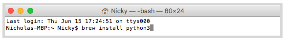
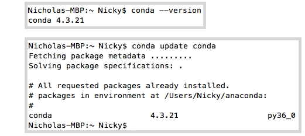
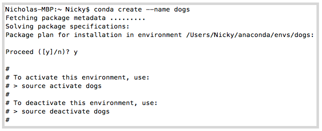
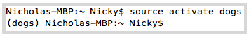
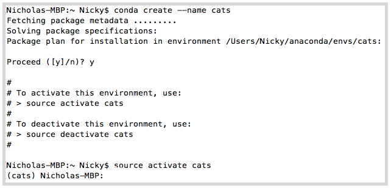
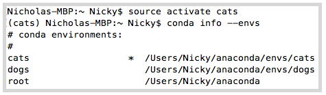
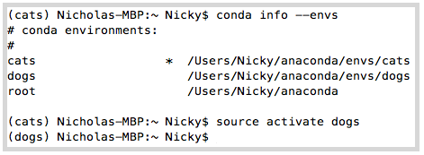

### Assignment \#1 - Curling Up With Python

---

### Installing Python Mac

1. Just run this command in your Terminal window: `brew install python3`

### Installing Python Windows

1. Head to the [Python Home Page](https://www.python.org/downloads/windows/), click the latest Python 3 release - Python3.6.1.
2. Follow the install instructions.

### Installing Anaconda

1. Head to the [Anaconda Home Page](https://www.anaconda.com/distribution/), scroll down, and click on the logo for your operating system to download the appropriate installer. Then, simply open the installer and follow the on-screen instructions. If you run into complications, the [detailed installation guide](https://docs.continuum.io/anaconda/install) will walk you through the process step-by-step.

### Creating and Managing Python Virtual Environments

#### Virtual Environments - What and Why?

The Python docs tell us that Python applications will often use packages and modules that don’t come as part of the standard library. Applications will sometimes need a specific version of a library because they may require that a particular bug has been fixed or the application may be written using an obsolete version of the library’s interface.

This means it may not be possible for one Python installation to meet the requirements of every application. If application A needs version 1.0 of a particular module but application B needs version 2.0, then the requirements are in conflict and installing either version 1.0 or 2.0 will leave one application unable to run.

The solution for this problem is to create a virtual environment, a self-contained directory tree that contains a Python installation for a particular version of Python, plus a number of additional packages. Check out the [Python Virtual Environment Docs](https://docs.python.org/3/tutorial/venv.html) for more info!

#### Conda

There are other multiple ways to create virtual environments, but in this course we will be using Conda.

Conda is a package manager application that quickly installs, runs and updates packages and their dependencies. It allows you to easily set up and switch between environments on your local computer. Conda is included in all versions of Anaconda and Miniconda. Check out the [Conda Docs](https://conda.io/docs/using/index.html) for more info!

#### Creating Virtual Environments

Verify that Conda is installed by checking it's version with `conda --version`. Next let's update Conda using the update command `conda update conda`. If a newer version is available, go ahead and accept the update.

1. Create your first virtual environment with the command `conda create --name dogs`. This will create a brand new environment with the name `dogs`.

   

2. Activate your new environment with the command \(Mac\)`source activate dogs`, \(Windows\)`activate dogs`. You can also deactivate environments with \(Mac\)`source deactivate dogs`, \(Windows\)`deactivate dogs`. Note that your environment will live in`/envs/dogs`.

   

3. Let's create and activate another environment. Type `conda create --name cats` followed by \(Mac\) `source activate cats` or \(Windows\) `activate cats`.

   

4. Let's list out our new environments with the command `conda info --envs`. You should see both of your new environments plus your root`/home/username/miniconda`.

   

5. Conda puts an asterisk next to your active environment. Again, type `conda info --envs` to verify which environment is active and then type \(Mac\)`source activate dogs` to change back to `dogs` or \(Windows\)`activate dogs`.

   

#### Additional Commands

Copy:  `conda create --name fish --clone dogs`. This will make a copy of `dogs`named `fish`.

Delete: `conda remove --name fish --all`. This will delete `fish`.
