## Get Yo' Tools Installed on Mac

---

In this class, you can expect to be exposed to a wide range of tools with names you may have never heard - tools like Excel, Git and VS Code. At first, the sheer number of tools you'll be expected to use may seem overwhelming but trust us! With a little time and with a little effort, they will be as familiar to you as a scalpel is to a surgeon or a sewing needle is to a seamstress.

### Overview

In this assignment you will be installing all the required tools and software necessary for the class. We've got a lot to install so buckle in and get ready!

### Before You Begin

Make sure you sign up for these services; you'll need all of them throughout the course.

* LinkedIn: [https://www.linkedin.com](https://www.linkedin.com/)
* GitHub: [https://github.com](https://github.com/)
* Stack Overflow: [http://stackoverflow.com](http://stackoverflow.com/)

Don't just create logins. Job recruiters often scour these sites in search of job candidates; make sure you provide your headshot and your contact info on all three services.

P.S. Don’t forget to outline your skills and your work experience on LinkedIn.

Also, make sure to accept the invite for your section on [Slack](https://slack.com/) as well. You will receive the link to your class-specific channel during orientation.

### Da Big Installation Enchilada

The rest of this assignment will walk you through the specific steps associated with installing each of the tools you'll need. Follow the instructions closely!

#### Google Chrome

During this course, consider Chrome the web browser. It comes loaded with tools for quickly editing the web pages you’ll create.

1. If you don’t already have Chrome installed, visit the download page [here](https://www.google.com/chrome/browser/desktop/index.html).

   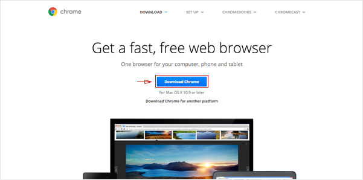

2. Download, open and run through Chrome’s installation file.

#### Slack

You’ll be messaging your instructor, your TAs and your fellow classmates with this business-centric chatting app. The teaching and career staff will post some of their most important announcements here so set this program up as soon as you can. You will receive the link to your class-specific channel during orientation.

1. If you don’t have the Slack app yet, search for Slack in your Mac’s App store and then click the Get button under the app’s listing. Click the button again when it displays “install.”

   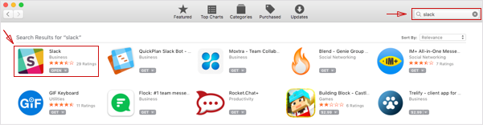

   * When the app finishes installing, open it and move on to step 2.

2. If you already use the Slack app, you just need to add our channel to your application.

   * Click the header of your current Slack Channel.

   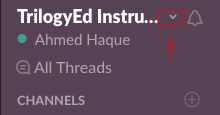

   * Then select “Sign in to another team …”

   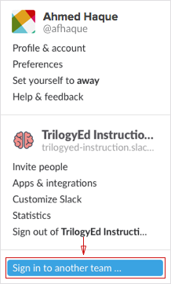

3. As you run through the guide, make sure you do the following:

   * Enter in the domain we gave you for Slack.

   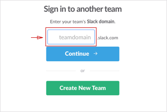

   * Enter in the email with which we invited you, as well as your password, when prompted.

   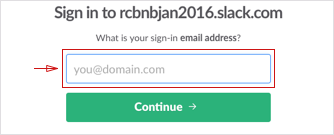

#### Microsoft Excel

1. Go to the [Microsoft Store](https://www.microsoft.com/en-us/store/d/excel-2016-for-mac/cfq7ttc0k5f2) and click the "Buy and Download" button. Make sure it's Excel 2016 or later that you are downloading.
   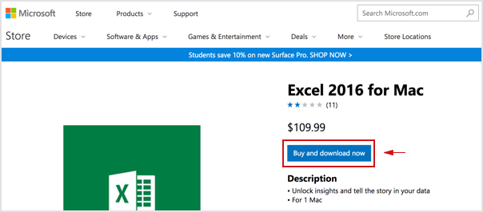
2. Follow the set up instructions after the download is completed.

#### Terminal

You’ll be entering your command line code through this interface. Since you’re on a Mac right now, you already have it! Just follow these steps to open the program.

1. Press command+space bar to open Spotlight Search.

   

2. Type “Terminal” into the search and then hit enter.

   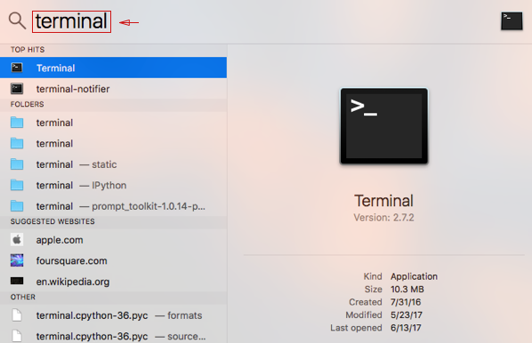

3. Keep this window open; you’ll need it for the next steps.

   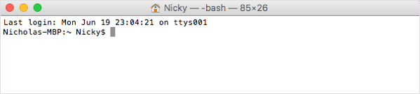

#### Heroku Toolbelt

This tool lets developers deploy their web apps to the cloud, allowing anyone with the right addresses to access their creations.

1. First, you need to sign up for a free Heroku account: [https://signup.heroku.com/](https://signup.heroku.com/).

2. Then go to [https://toolbelt.heroku.com](https://toolbelt.heroku.com/). Download the installer.

   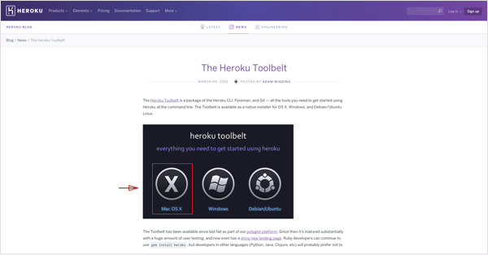

3. Go through the install guide. Then open Terminal. Type `heroku login` into the command line and then press return.

   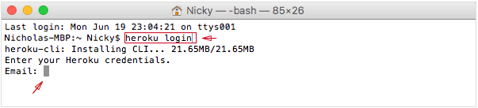

4. When prompted, enter the credentials you used when you signed up for your Heroku account.

#### Homebrew

This tool makes it a cinch to install new programs and libraries in your Terminal window.

1. Go to [http://brew.sh](http://brew.sh/). Copy the script listed under “Install Homebrew.”

   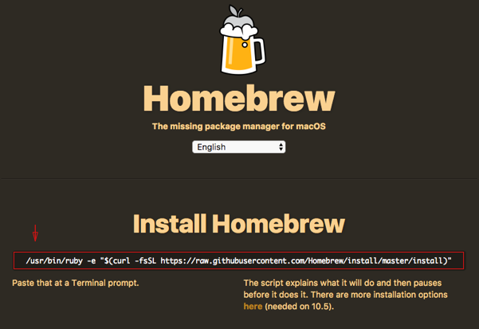

2. Paste the script into your Terminal window. Press the return key when prompted.

   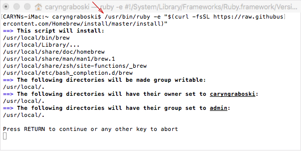

#### Mongo DB

Since installing MongoDB is somewhat involved and we won't be using MongoDB until rather late in the course, it's not necessary to have it installed on Day 1 - there will be time later for us to set it up together.

However, if you'd like to get a head start, [installation instructions for Windows user are here](https://docs.mongodb.com/manual/tutorial/install-mongodb-on-windows/) and [installation instructions for OS X are here](https://docs.mongodb.com/manual/tutorial/install-mongodb-on-os-x/).

#### SSH Key

Generating SSH keys allows developers to interface with certain remote services without having to constantly type out login information. You're going to set up an SSH key for GitHub.

Without a key, you won’t be able to push your code to GitHub without entering a password each time; trust us, that would be as irritating as needing a key to open every door in your home.

1. Sign up for an account on [https://github.com](https://github.com/).

2. Open up Terminal.

3. We need to set up SSH keys. First, let’s make sure you don’t already have a set of keys on your computer. Type this into your Terminal window\(copying and pasting will not work\):

   * `ls –al ~/.ssh`

   * If no keys pop up, move on to step 4.

   * If keys do pop up, check that none of them are listed under `id_rsa`, like in this image:

     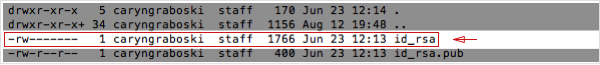

   * If you do find a key with a matching name, then you can either overwrite it by following steps 4 to 6 or you can use the same key in steps 10 and beyond. Be advised that you'll have to remember the password tied to your key if you decide not to overwrite it.

4. Type in this command along with your email to generate your keys:

   * `ssh-keygen –t rsa –b 4096 –C "YOURGITHUBEMAIL@PLACEHOLDER.NET"`

5. When asked to enter a file to save the key, just hit the return key.

   * Also enter a passphrase for your key.

   * Note: You shouldn’t see any characters appear in the window while typing the password.

6. When you’re finished your window should look like this:

   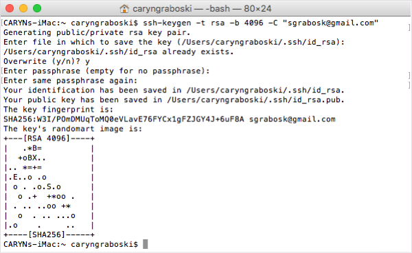

7. For the next step, we need to use a tool called an SSH Agent. Let’s test whether that’s working on your machine. Run this command in Terminal:

   * `eval "$(ssh-agent –s)"`

   * If your Terminal window looks like the image below, move onto the next step.

     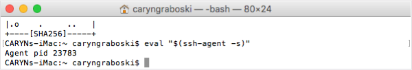

8. Now run this command:

   * `ssh-add ~/.ssh/id_rsa`

9. When prompted for a passphrase, enter the one associated with the key.

   * If you’ve forgotten this key, just go through step 4 to create a new one.

10. We need to add the key to GitHub. Copy the key to your clipboard by entering this command:

    * `pbcopy < ~/.ssh/id_rsa.pub`

    * You shouldn’t see any kind of message when you run this command. If you do, make sure you entered it correctly.

    * Do not copy anything else until you finish the next steps. Otherwise, you’ll have to enter the copy command again.

11. Go to [https://GitHub.com/settings/ssh](https://github.com/settings/ssh). Click the “New SSH key" button.

    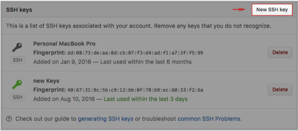

12. When the form pops up, enter a name for your computer in the Title input. In the Key input, paste the SSH key you copied in Step 10.

    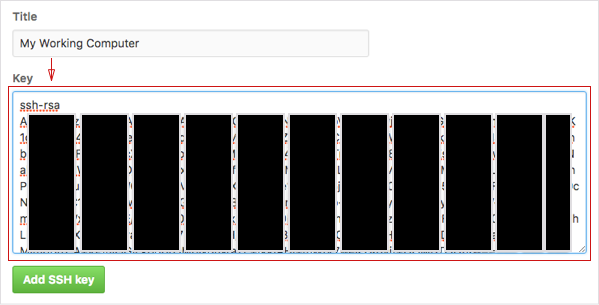

13. Now we just need to add GitHub to your computer’s list of acceptable SSH hosts. Go back to your Terminal window. Type in this command: `ssh –T git@github.com`

    * You should see an RSA fingerprint in your window. Only enter “yes” If it matches the one highlighted in the image below:

    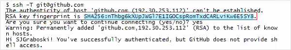

#### Setting your Git username for every repository on your computer

Git uses a username to associate commits with an identity. The Git username is not the same as your GitHub username.

You can change the name that is associated with your Git commits using the `git config` command. The new name you set will be visible in any future commits you push to GitHub from the command line. If you'd like to keep your real name private, you can use any text as your Git username. Changing the name associated with your Git commits using `git config` will only affect future commits and will not change the name used for past commits.

#### Setting your email address for every repository on your computer

GitHub uses the email address set in your local Git configuration to associate commits pushed from the command line with your GitHub account.

You can use the `git config` command to change the email address you associate with your Git commits. The new email address you set will be visible in any future commits you push to GitHub from the command line. Any commits you made prior to changing your commit email address are still associated with your previous email address.

For more information on commit email addresses, including your GitHub-provided `noreply` email address, see "[About commit email addresses](https://help.github.com/articles/about-commit-email-addresses/)."

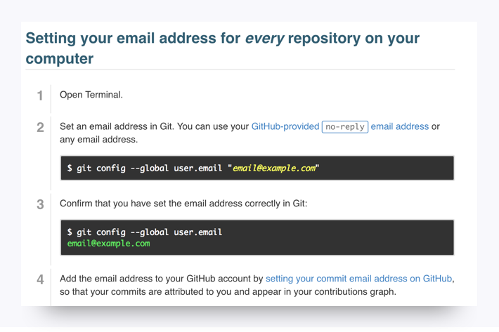

#### VS Code

1. Head to the [Visual Studio Code](https://code.visualstudio.com/docs/setup/setup-overview) docs and select the appropriate installation for your machine.
2. Click on Download Visual Studio Code for Mac.
   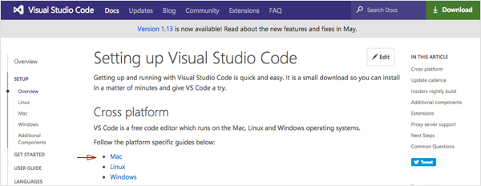
3. Double-click the downloaded archive to expand the contents.
4. Drag the Visual Studio Code app to the Applications folder, making it available in the Launchpad.
5. Add VS Code to your Dock by right-clicking on the icon and choosing Options, Keep in Dock.

### Amaze-Balls!

If you got through all the installations, give yourself a pat on the back! Installations are never fun, but just like taxes, ya gotta do them.

Be sure to take a break before continuing with the rest of the pre-work.
