## Get Yo' Tools Installed on Windows

---

In this class, you can expect to be exposed to a wide range of tools with names you may have never heard - tools like Excel, Git and VS Code. At first, the sheer number of tools you'll be expected to use may seem overwhelming, but trust us! With a little time and with a little effort, they will be as familiar to you as a scalpel is to a surgeon or a sewing needle is to a seamstress.

## Overview

In this assignment, you will be installing all the required tools and software necessary for the class. We've got a lot to install so buckle in and get ready!

## Before You Begin

Make sure you sign up for these services; you'll need all of them throughout the course.

* LinkedIn: [https://www.linkedin.com](https://www.linkedin.com/)
* GitHub: [https://github.com](https://github.com/)
* Stack Overflow: [http://stackoverflow.com](http://stackoverflow.com/)

Don't just create logins. Job recruiters often scour these sites in search of job candidates; make sure you provide your headshot and your contact info on all three services.

P.S. Don’t forget to outline your skills and your work experience on LinkedIn.

Also, make sure to accept the invite for your section on [Slack](https://slack.com/) as well. You will receive the link to your class-specific channel during orientation.

## Da Big Installation Enchilada

The rest of this assignment will walk you through the specific steps associated with installing each of the tools you'll need. Follow the instructions closely!

#### Google Chrome

During this course, consider Chrome the web browser. It comes loaded with tools for quickly editing the web pages you’ll create.

1. If you don’t already have Chrome installed, visit the download page [here](https://www.google.com/chrome/browser/desktop/index.html).

   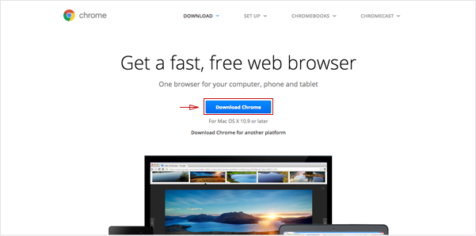

2. Download, open and run through Chrome’s installation file.

#### Slack

You’ll be messaging your instructor, your TAs and your fellow classmates with this business-centric chatting app. The teaching and career staff will post some of their most important announcements here so set this program up as soon as you can. You will receive the link to your class-specific channel during orientation.

1. If you don’t have the Slack app yet\**, \**go to [https://slack.com/downloads](https://slack.com/downloads). Select "Windows" to download the installation file, and then open the program.

   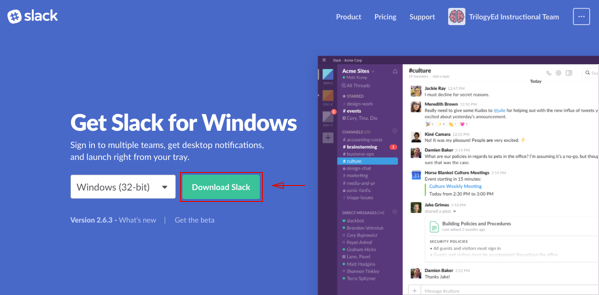

2. If you already use the Slack app\**, \**you just need to add our channel to your application.

   * Click the header of your current Slack Channel.

     

   * Then select “Sign in to another team …”

     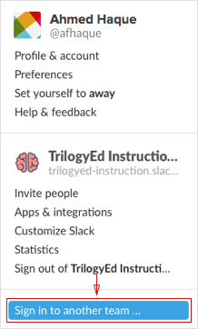

3. As you run through the guide, make sure you do the following:

   * Enter in the domain we gave you for Slack.

     

   * Enter in the email with which we invited you, as well as your password, when prompted.

     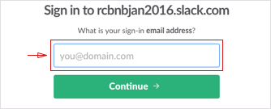

4. When you see the chatroom, you’re finished.

#### Microsoft Excel

1. Go to the [Microsoft Store](https://www.microsoft.com/en-us/store/d/excel-2016/cfq7ttc0k5f3?WT.mc_id=pointitsem+Google+Adwords+Excel+-+EN+-+US&s_kwcid=AL!4249!3!196006328101!p!!g!!microsoft excel download&invsrc=search&cl_vend=google&cl_ch=sem&cl_camp=715612014&cl_adg=37518507295&cl_crtv=196006328101&cl_kw=microsoft excel download&cl_pub=google.com&cl_place=&cl_dvt=c&cl_pos=1t1&cl_mt=p&cl_gtid=kwd-108715884&cl_pltr=&cl_dim0=V-ht2gAAAbwPveFU:20170619151317:s&ef_id=V-ht2gAAAbwPveFU:20170619151317:s) and click the Buy and Download button. Make sure it's Excel 2016 or later that you are downloading.

   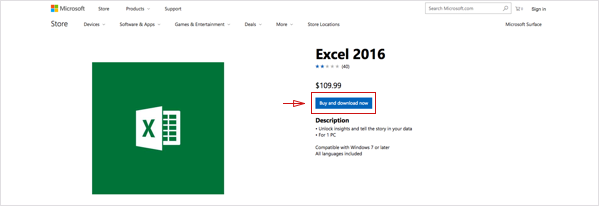

2. Follow the set up instructions after the download is completed.

#### Git & Git Bash

Coders depend on this tool for version control; the process of logging the development of programs and applications. This comes in handy during collaborative programming, when teams of programmers change, add and remove code throughout a project’s directory. This process would be chaotic without Git.

The installation also includes Git Bash or Bash for short. You'll be using this command line terminal throughout the course and during the rest of these instructions.

1. Go to Git download page: [https://git-scm.com/downloads](https://git-scm.com/downloads). Click on the download for your computer.

   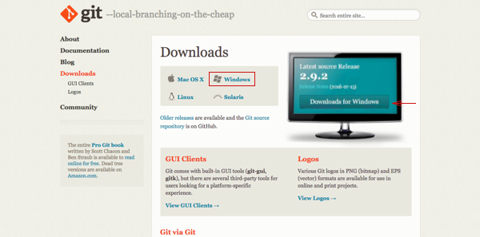

2. Run through the installation file. Make sure you check off the right boxes as shown in these four images.

   * Save Git to the desktop \(this should save Git Bash to your desktop too\).

     

   * Use Git from the Windows Command Prompt.

     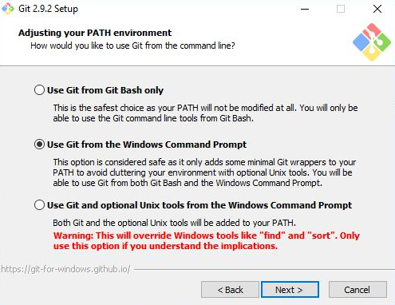

   * Checkout as-is.

     

   * Use Windows' default console window.

     

#### Heroku Toolbelt

This tool lets developers deploy their web apps to the cloud, allowing anyone with the right addresses to access their creations.

1. First, you need to sign up for a free Heroku account: [https://signup.heroku.com/](https://signup.heroku.com/).

2. Go to [https://toolbelt.heroku.com](https://toolbelt.heroku.com/). Download the installer.

   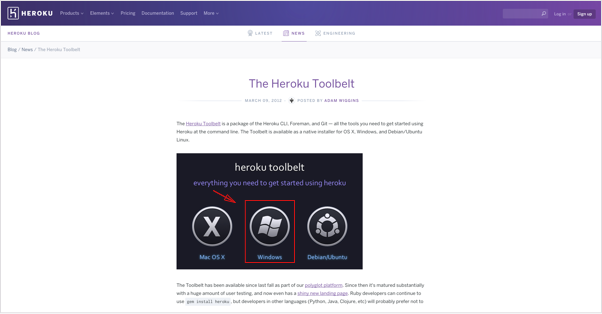

3. Go through the installation guide then open Command Prompt on your computer \(not Bash\).

   * Command Prompt or cmd.exe, comes preloaded on Windows operating systems but it will be located in different locations depending on your version of Windows. Use your OS's search feature for Command Prompt and it should pop up shortly.

4. Type `heroku login` into the command line, press enter When prompted, enter the credentials from your Heroku account and then close Command Prompt.

#### Mongo DB

Since installing MongoDB is somewhat involved and we won't be using MongoDB until rather late in the course, it's not necessary to have it installed on Day 1 - there will be time later for us to set it up together.

However, if you'd like to get a head start, [installation instructions for Windows user are here](https://docs.mongodb.com/manual/tutorial/install-mongodb-on-windows/) and [installation instructions for OS X are here](https://docs.mongodb.com/manual/tutorial/install-mongodb-on-os-x/).

#### SSH Key

Generating SSH keys allows developers to interface with certain remote services without having to constantly type out login information. You're going to set up an SSH key for GitHub.

Without a key, you won’t be able to push your code to GitHub without entering a password each time; trust us, that would be as irritating as needing a key to open every door in your home.

1. If you haven't signed up for a GitHub account yet, you'll need to do so before moving on with these steps. Visit [https://github.com](https://github.com/).

2. Open up Bash.

3. We need to set up SSH keys. First, let’s make sure you don’t already have a set of keys on your computer. Type this into your Bash window**\(copying and pasting will not work\)**:

   * `ls –al ~/.ssh`

   * If no keys pop up, move onto step 4.

   * If keys do pop up, check that none of them are listed under `id_rsa`, like in this image:

     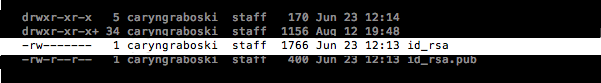

     * If you do find a key with a matching name, then you can either overwrite it by following steps 4 to 6, or you can use the same key in steps 10 and beyond. Be advised that you'll have to remember the password tied to your key if you decide not to overwrite it.

4. Type in this command along with your email to generate your keys

   * `ssh-keygen –t rsa –b 4096 –C "YOURGITHUBEMAIL@PLACEHOLDER.NET"`

5. When asked to enter a file to save the key, just hit enter.

   * Also enter a passphrase for your key.

   * Note: You shouldn’t see any characters appear in the window while typing the password.

6. When you’re finished, your window should look like this:

   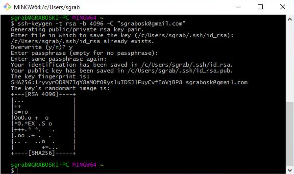

7. For the next step, we need to use a tool called ssh agent to link our key with our machine. Let’s test whether ssh-agent is working. Run this command in Bash:

   * `eval "$(ssh-agent –s)"`

   * If your Bash window looks like the below image, move onto the next step.

     

8. Now run this command:

   * `ssh-add ~/.ssh/id_rsa`

9. When prompted for a passphrase, enter the one associated with the key.

   * If you’ve forgotten this password, just create a new one, starting with step 4.

10. We need to add the key to GitHub. Copy the key to your clipboard by entering this command:

    * `clip < ~/.ssh/id_rsa.pub`

    * You shouldn’t see any kind of message when you run this command. If you do, make sure you entered it correctly.

    * Do not copy anything else to your clipboard until you finish the next instructions. Otherwise, you’ll have to repeat this step again.

11. Go to [https://github.com/settings/ssh](https://github.com/settings/ssh). Click the “New SSH Key” button.

    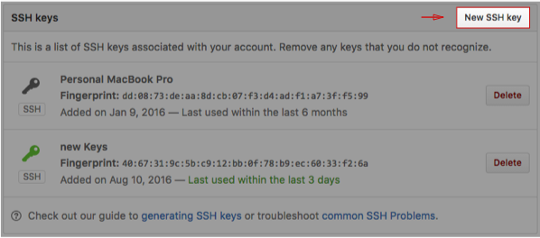

12. When the form pops up, enter a name for your computer in the Title input. In the Key input, paste the SSH key you copied in step 10.

    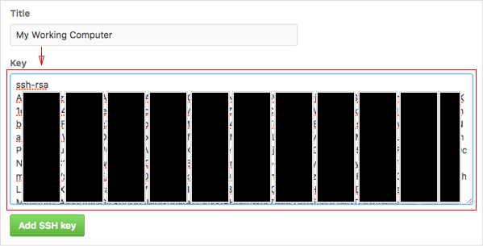

13. Now we just need to add GitHub to your computer’s list of acceptable SSH hosts. Go back to your Bash window. Type in this command: `ssh –T git@github.com`

    * You should see an RSA fingerprint in your window. Only enter “yes” if it matches the one highlighted in the image below.

      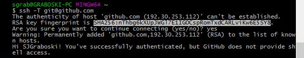

#### Setting your Git username for every repository on your computer

Git uses a username to associate commits with an identity. The Git username is not the same as your GitHub username.

You can change the name that is associated with your Git commits using the `git config` command. The new name you set will be visible in any future commits you push to GitHub from the command line. If you'd like to keep your real name private, you can use any text as your Git username. Changing the name associated with your Git commits using `git config` will only affect future commits and will not change the name used for past commits.

#### Setting your email address for every repository on your computer

GitHub uses the email address set in your local Git configuration to associate commits pushed from the command line with your GitHub account.

You can use the `git config` command to change the email address you associate with your Git commits. The new email address you set will be visible in any future commits you push to GitHub from the command line. Any commits you made prior to changing your commit email address are still associated with your previous email address.

For more information on commit email addresses, including your GitHub-provided `noreply` email address, see "[About commit email addresses](https://help.github.com/articles/about-commit-email-addresses/)."

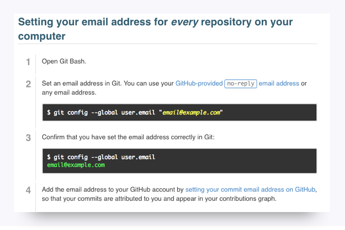

#### VS Code

1. Head to the [Visual Studio Code](https://code.visualstudio.com/docs/setup/setup-overview) website and select the appropriate installation for your machine.
2. Download the Visual Studio Code installer for Windows.
   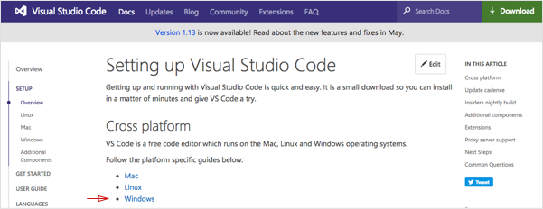
3. Once it is downloaded, run the installer \(VSCodeSetup-version.exe\). This will only take a minute
4. By default, VS Code is installed under C:\Program Files \(x86\)\Microsoft VS Code for a 64-bit machine.

## Amaze-Balls!

If you got through all the installations, give yourself a pat on the back! Installations are never fun, but just like taxes, ya gotta do them.

Be sure to take a break before continuing with the rest of the pre-work.
