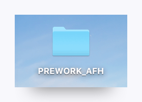
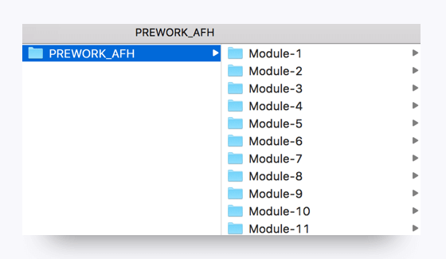
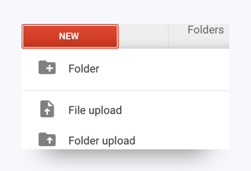
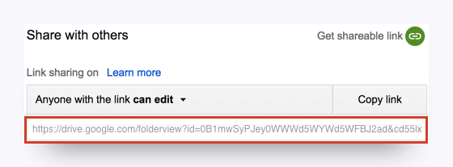

# Module \#1 - Prepare for Pre-Work!

---

## Use The Right Tools for the Job

To ensure you can successfully use all of the tools and technologies used in this course, you need to have the right equipment to work on. Below are the equipment requirements for this course. **If you don't meet these requirements, please contact your Student Success Manager.**

Taking an in-person class?

* Mac or Windows with 8GB ram and dual processor \(64 bit, no 32 bit\)
* No Linux allowed

Taking an online class?

* Mac or Windows with 8GB ram and dual processor \(64 bit, no 32 bit\)
* No Linux allowed
* Second monitor compatible with laptop
* Webcam, microphone, headphones
* High speed internet connection in a quiet space \(Minimum: Download 25 Mbps, Upload 5 Mbps\)

---

### How to Submit Pre-Work

Ultimately, you will be submitting each of the completed assignments in a single folder onto [Bootcampspot-v2.com](http://www.bootcampspot-v2.com/). You will be given access to the site upon enrollment.

Once you gain access, you can use the below instructions as a final submission guide.

1. Create a local folder on your computer titled: PREWORK\_{INITIALS} \(with your initials replacing the stuff in brackets, e.g. "PREWORK\_AFH"\).

2. Inside of the folder create sub-folders for each of the assignments. Your folder should look something like the below.

3. Upon completing each assignment, save your solution into the associated sub-folder of your pre-work folder. In some cases, this will mean copying multiple files into the sub-folder.

4. Then create an account on [Google Drive](https://www.google.com/drive/) if you do not already have one.

5. Once you are done with all of the pre-work, utilize the "Folder Upload" button on Google Drive to upload the folder onto Google Drive.

6. Then right click the folder on Google Drive and change the sharing settings such that anyone with the link can edit.

7. Copy the link associated with your folder in Google Drive.

8. Then log in to Bootcampspot and find the Pre-Work Assignment associated with your class.

9. Click on the assignment and paste the Google Drive link so your Instructor and TA can review your assignment.

And that's it. Now get cracking on those modules!

---

### Assignment:

* None!

### Supplemental Resources:

* [Google Drive](https://www.google.com/drive/)
