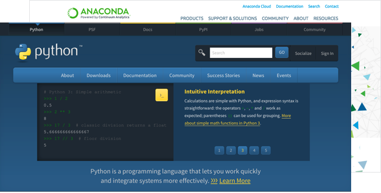

# Module \#2 - Get Yo'self Machine Ready

---

### More than Data...

In this class, you can expect to be exposed to a wide range of tools with names you may have never heard—tools like Excel, Git and VS Code. At first, the sheer number of tools you'll be expected to use may seem overwhelming, but trust us! With a little time and with a little effort, they will be as familiar to you as a scalpel is to a surgeon or a sewing needle is to a seamstress.

They're all just tricks of the trade.

### Ready for Action!

Coming into your first day of class, you will be expected to have several tools already installed. This will ensure you're ready to start learning immediately. The purpose of this module is to walk you through the process of installing all your tools and give you a brief primer on the roles they play.

After completing this module, you will have each of the following installed:

* Google Chrome
* Slack
* Microsoft Excel
* Git / GitHub
* Git Bash \(Windows Only\)
* Terminal \(Mac Only, Pre-Installed\)
* Heroku Toolbelt
* Homebrew \(Mac Only\)
* Mongo DB
* VS Code

In addition, you will also have accounts on each of the following websites:

* LinkedIn
* GitHub
* Stack Overflow
* Slack

**Having trouble with set up? Not to worry. Your instructional staff will help you troubleshoot any errors and answer any questions on the first day of class. Just sit tight until then!**

---

### Tools for Fools

Before we start installing everything willy-nilly, let's take a moment to examine each of these tools to better understand the role they play.

#### Google Chrome

This one is straightforward. It's a web browser. In our case, we'll be using it to quickly see if our code is working. While in truth, you can use any web browser, Google Chrome has a number of tools that make it an ideal platform for developing so we strongly encourage you to make the switch.

  

#### Slack

This is one you will be using literally every single day for the next six months. Slack is an online communication tool that is a mix of forum, of instant messenger and of email - all rolled in one. It's a tool that is used by countless organizations worldwide.

In our Bootcamp, we'll be using Slack extensively to send code snippets during class, to relay important announcements and to facilitate group exercises. You will receive the link to your class-specific channel during orientation. You will definitely want to have this installed on Day 1. \(Note how we said installed and not simply logged into. While the web client is good, for our class, you will want to install the actual program on your machine.\)

  

#### Microsoft Excel

You'll be learning the ins and outs of Microsoft Excel in the first few weeks of the course. You can get Excel on a subscription basis via Office 365 or as a one-time purchase. Details on both options are available at the Microsoft Store. Be sure to select the correct operating system  and that it is Excel 2016 or later before purchase.

Once you've paid for and downloaded the software, you'll be prompted with the latest installation instructions for your platform. Simply follow them and confirm your installation after by opening Excel!

  

#### Git / Github

Because code files are ones in which multiple developers need to carefully build upon each other's work, Git offers a specialized set of strategies for orchestrating the collaboration. GitHub then takes all these collaborative actions and stores them online. In a way, GitHub serves as a sort of Dropbox for coders. It offers a central place for individuals or teams to upload their code, to view revision history and to make changes to a master set of files. You'll come to learn a lot about Git and GitHub in your first week of class. You will receive the link to your class-specific repository during orientation.

  

#### Git Bash \(Windows Only\) / Terminal \(Mac, Pre-installed\)

Git Bash \(Windows\) and Terminal \(Mac\) offer a command line interface for working with the files and folders on your computer.

_So is it like Finder or Windows Explorer?_

Kind of... except there are no pictures or visuals. It's just a box with text

  

_Uh, why would I want that?_

You'll come to understand over time, but in many situations, utilizing a command line interface can be faster and can be more powerful than relying on the operating system's GUI. You'll get plenty of exposure to the command line on day one.

#### Homebrew \(Mac Only\)

Homebrew is a Mac-specific toolkit that makes it easy to install, using the command line, a variety of applications. It can greatly simplify the installation process for various tools you'll be using in your development career.

  

#### Heroku Toolbelt

While you may not feel ready yet, very quickly, you'll be creating complete websites on your computers. But once you have these sites made, how do you get them online for the world to see?

Hosting platforms like Heroku effectively serve as a dumping ground for web applications. These platforms are set up to take your web applications' code, to activate them and to then assign them to a URL for other visitors to see. In a sense, they host your applications so that every internet user has access to them. You'll learn a lot about how this works towards the tail end of the course.

As it relates to the pre-work, you'll be installing the Heroku Toolbelt which offers a set of easy-to-use tools for interacting with the Heroku platform online.

  

#### Python & Anaconda

Python and its ecosystem are extremely popular tools in the world of data analysis. This course will use a popular all-in-one solution called Anaconda which contains everything we'll need for the Python units of the course.

  

#### Mongo DB

Like MySQL, MongoDB is a database but it works in a fundamentally different way and has certain advantages and disadvantages as compared to MySQL. We'll use it during the web portion of the course.

  

#### VS Code

Oh, the power of VS Code! A little program that does so much!

  

VS Code \(Visual Studio Code\) is a free text editor that runs on the Mac, Linux and Windows operating systems. Now, for the uninitiated, the first thought that comes to mind when we say text editor may be something basic like Notepad or TextEdit. But for developers, text editors are like the cozy pillow on which they rest their heads. This is because fundamentally, programming is all about creating text in files with various extensions. When we create a block of HTML like the one below...

  

...what we've really done is just created a block of text.There are funny symbols in there like those angle brackets and what not but at it's most basic level, it's just text.

Now to a simple text editor, this is where the comprehension stops. Our block of HTML remains a block of text. But to more powerful text editors like VS Code on the other hand, these blocks of text are immediately recognized as code \(so long as you include the right file extension\). This means that VS Code can give us a more visually intuitive understanding of the code through indicative coloring, smart tabs and through its autocomplete functionality. The result is that creating the above block of HTML becomes a more natural process and also one that can be debugged more quickly.

### Collect Your Tools

And that's it!

It's time to collect your tools and begin. As you'll see in the links below, we have guides for both Mac and Windows users on the process for getting setup. Follow the instructions closely and do your best with the information you have. \(Yes, we know there is a lot to install.\)

Just one bit of advice! Throughout the course, you will frequently be looking at documentation to install and to utilize unfamiliar tools. Resist the urge to stop and ask, "Am I doing this right?" Instead, just take your best stab at it. This is an important attitude to start developing _now_. A lot of what you'll be exposed to over the next six months will be unfamiliar. Don't be phased by it and don't get bogged down by it. Trust your instincts! We'll make sure that anyone who is lost gets the help they need on day one.

Good luck! Make sure your tools are extra pointy.

---

### Assignments \(Required\)

* [Get Yo' Tools Installed on Mac](get-yo-tools-installed-on-mac.md)

* [Get Yo' Tools Installed on Windows](get-yo-tools-installed-on-windows.md)

* [Curling Up With Python](curling-up-with-python.md)
