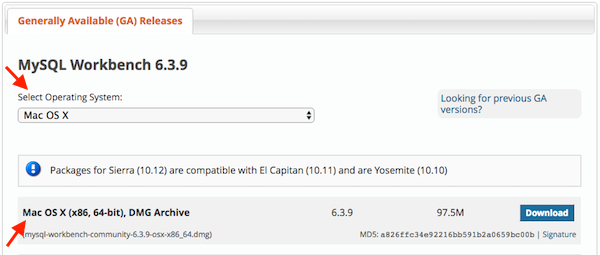
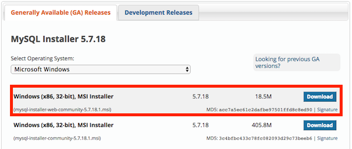

#### MySQL & MySQL Workbench

Roughly halfway through the course, we'll learn about databases. We'll be using MySQL for these units, as it's both freely available, and one of the world's most popular database solutions,

In addition to MySQL, we will need to install a tool, called MySQL workbench, that makes working with it a bit easier, we'll start by downloading that.

Visit the [MySQL workbench download page](https://dev.mysql.com/downloads/workbench/); scroll to the bottom; select your operating system; in the form; and then download and run the installer.

Installing MySQL is as simple as downloading and running the appropriate installer. See the links below for instructions specific to your platform.

#### Installing MySQL on Windows

Visit the [MySQL installer downloads page](https://dev.mysql.com/downloads/installer/). Scroll to the bottom to find the installer downloads.

There are two options—one for installing while online, and one for installing while offline. We recommend downloading the former, called the **web community** installer, as it's a smaller file to download. This is typically the top file.

Once you've downloaded the installer, follow the instructions to install MySQL.

During the installation, you will be prompted to create a password. **Be absolutely sure to record this password**—it's essential for working through the MySQL lessons.

#### Installing MySQL on OS X

First, [visit the MySQL downloads page](https://dev.mysql.com/downloads/mysql/). Then, scroll to the bottom; select **Mac OS X** as your operating system; download the DMG— not  the TAR archives—and follow the [Mac OS X installation instructions](https://dev.mysql.com/downloads/mysql/).

During the installation, you will be prompted to create a password. **Be absolutely sure to record this password**—it's essential for working through the MySQL lessons.

#### MongoDB

Like MySQL, MongoDB is a database. But, it works in a fundamentally different way, and has certain advantages and disadvantages as compared to MySQL. We'll use it during the web portion of the course.

Since installing MongoDB is somewhat involved and we won't be using MongoDB until rather late in the course, it's not necessary to have it installed on Day 1—there will be time later for us to set it up together.

However, if you'd like to get a head start, [installation instructions for Windows users are here](https://docs.mongodb.com/manual/tutorial/install-mongodb-on-windows/#get-mongodb-community-edition), and [installation instructions for OS X are here](https://docs.mongodb.com/manual/tutorial/install-mongodb-on-os-x/#install-mongodb-community-edition).
